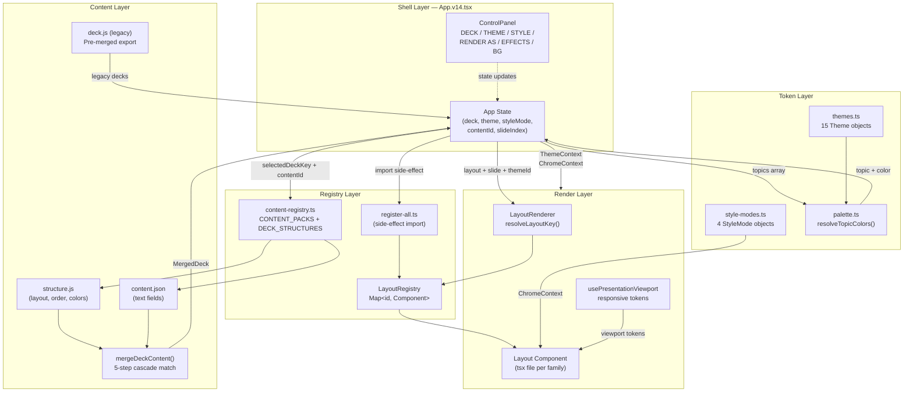
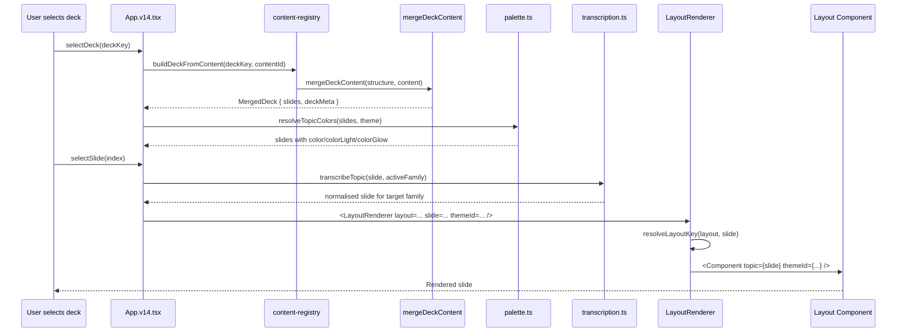

# Documentation Review — Presentation System

> Generated: 2026-04-13
> Scope: `C:\Users\tandf\source\present\`

---

## Executive Summary

| Area | Status | Severity |
|------|--------|----------|
| README accuracy | Partially inaccurate | High |
| Architecture diagram | Missing | High |
| Data flow diagram | Missing | High |
| Key interface docs | Partial (good in-source) | Medium |
| How-to: add layout family | Missing | High |
| How-to: add theme | Missing | Medium |
| How-to: add content deck | Missing | High |
| Known issues / tech debt | Undocumented | Critical |
| Storybook autodocs | Setup correct; story count outdated | Low |
| `mergeDeckContent` cascade algorithm | Undocumented externally | Medium |
| Transcription `as any` intent | Undocumented | Medium |
| `Particles type="future"` bug | Undocumented | Critical |
| `border` on Theme interface | Missing field | Medium |
| Zod / `validateDeckManifest` usage | Undocumented | Low |

---

## Section 1 — README Accuracy

### Inaccuracies Found

| Item | README says | Actual |
|------|-------------|--------|
| React version | "React 18" | `package.json` declares `react: ^18.2.0`; CLAUDE.md says "React 19" — inconsistency |
| Entry file extension | `App.v14.jsx` | File is `App.v14.tsx` (TypeScript) |
| Layout ID list in `register-all.ts` | Lists "process-cycle" under Sprint | Correct, but Sprint family also contains `CircularRingCycle` and `Figure8Cycle` sub-components — not independent layouts |
| `stat-cards-manifest` | Not mentioned | Is a distinct registered layout ID resolved automatically by `LayoutRenderer` |
| Storybook story count | "60 stories" | Likely stale; needs manual recount |
| Content packs | "6 content decks + 4 reference/legacy" | `content-registry.ts` registers 8 content packs: `current`, `genai`, `engineering`, `onboarding`, `atelier-sage`, `signal-cobalt`, `verge-pop`, `studio` |
| `main.jsx` | Referenced as the app version switcher | File is `main.tsx` (TypeScript) |
| Zod dependency | Not mentioned | `zod@^4.3.6` in `dependencies`; Zod schemas exist at `src/patterns/decks/schema.ts` but are **not called at runtime** — declared unused |

---

## Section 2 — Generated Architecture Documentation

### 2.1 Architecture Section for README

Paste this into `README.md` replacing the current Architecture section:

```markdown
## Architecture

### Layer Overview

| Layer | File(s) | Responsibility |
|-------|---------|---------------|
| **Shell** | `src/App.v14.tsx` | Deck factory, state, context providers, side-panel |
| **Layout Registry** | `src/layouts/registry.ts` | O(1) Map-based plugin system; 34 IDs across 8 families |
| **Layout Renderer** | `src/layouts/LayoutRenderer.tsx` | Resolves layout string → component; stat-cards multi-variant routing |
| **Transcription** | `src/transcription.ts` | Cross-family content normalisation (e.g. `adv-future` → `h-strip`) |
| **Content Registry** | `src/content/content-registry.ts` | Runtime content-pack swapping; `CONTENT_PACKS` + `DECK_STRUCTURES` maps |
| **Merge Utility** | `src/content/merge-deck-content.ts` | Cascading match algorithm — merges structure skeleton with text content |
| **Tokens** | `src/tokens/themes.ts`, `style-modes.ts`, `palette.ts` | 15 themes × 4 style modes orthogonal matrix; per-slide color resolution |
| **Contexts** | `src/components/context/` | `ThemeContext`, `ChromeContext` — consumed by all layout components |

### System Architecture Diagram



### Data Flow: Deck to Rendered Slide


```

### 2.2 Full Architecture Description

**Shell Layer (`App.v14.tsx`)**
The application shell owns all state: active deck key, slide index, theme ID, style mode ID, active content pack, and background/effects toggles. It provides `ThemeContext` and `ChromeContext` to the component tree. On startup it imports `register-all.ts` as a side effect — this populates the layout registry before any slide is rendered.

**Registry Layer**
`layoutRegistry` is a singleton `Map<string, LayoutComponent>` with `LayoutFeatures` metadata per entry. Each layout family has a `register.ts` file that calls `layoutRegistry.register(id, Component, features)`. `register-all.ts` re-exports all eight family registration files as side effects. The registry uses O(1) Map lookups and throws a descriptive error listing all registered IDs if an unknown layout is requested.

`LayoutRenderer` adds a thin resolution layer: for `stat-cards` it checks whether the slide has manifest-only fields (`results`, `leadershipPoints`, `enablement`, `thesis`) and routes to the `stat-cards-manifest` variant if so.

**Content Layer**
Each migrated deck consists of two files:
- `structure.js` — layout skeleton: slide `id`, `order`, `layout`, `role`, `color` triplet, `num`, `icon`
- `content.json` — text-only: `deck` (brand/title/stats) + `slides` (keyed by slide ID)

`mergeDeckContent()` combines them via a 5-step cascading match (see Section 5). `content-registry.ts` registers all 8 content packs and 8 structure entries, enabling runtime swapping.

**Token Layer**
Themes and style modes form an orthogonal matrix: any of 15 themes can be combined with any of 4 style modes. `palette.ts` builds a 6-color rotation from each theme's semantic tokens (`accent`, `gradient[0]`, `gradient[1]`, `success`, `warning`, `danger`) and assigns them to slides by index.

---

## Section 3 — Key Interfaces Quick Reference

### `Theme` (`src/tokens/themes.ts`)

```typescript
interface Theme {
  readonly id: string;           // e.g. "midnight-teal"
  readonly name: string;         // Display name
  readonly vibe: string;         // Short descriptor e.g. "Current Default"
  readonly fontDisplay: string;  // CSS font-family for headings
  readonly fontBody: string;     // CSS font-family for body text
  // Background surfaces
  readonly bg: string;           // Page background
  readonly bgCard: string;       // Card/panel background
  readonly bgDeep: string;       // Deeply nested surface
  readonly surfaceElevated: string; // Floating elevated surface
  // Text
  readonly text: string;         // Primary text
  readonly textMuted: string;    // Secondary text
  readonly textDim: string;      // Tertiary / disabled text
  // Accent
  readonly accent: string;       // Primary accent colour
  readonly accentGlow: string;   // rgba glow for the accent
  readonly gradient: readonly [string, string]; // Two-stop gradient
  // Semantic
  readonly success: string;
  readonly danger: string;
  readonly warning: string;
  // Optional
  readonly fontsUrl?: string;    // Google Fonts URL (injected at runtime)
}
```

> **Known gap:** `border` is used in some layout components (e.g. inline `border: \`${C.cardBorderWidth}px solid ...\``) but there is no `border` property on `Theme`. Border color is always derived from `topic.color` with an alpha suffix. This is correct behaviour but not documented.

### `StyleMode` (`src/tokens/style-modes.ts`)

```typescript
interface StyleMode {
  readonly id: StyleModeId;           // "default" | "brutalist" | "editorial" | "pop"
  readonly name: string;
  readonly vibe: string;
  // Geometry
  readonly cardRadius: number;        // px — outer card corner radius
  readonly innerRadius: number;       // px — inner card corner radius
  readonly tileRadius: number;        // px — landing tile corner radius
  readonly pillRadius: number;        // px — pill/tag corner radius
  readonly tagRadius: number;         // px — tag corner radius
  // Borders & accents
  readonly cardBorderWidth: number;   // px
  readonly accentBarHeight: number;   // px — coloured top/left accent bar
  readonly sectionGap: number;        // px — vertical gap between sections
  // Visual effects
  readonly useGlow: boolean;          // Enable box-shadow glow
  readonly useSoftShadow: boolean;    // Enable subtle drop shadow
  // Typography
  readonly headingWeight: number;     // CSS font-weight for headings
  readonly headingTransform: "none" | "uppercase";
  readonly labelTracking: number;     // letter-spacing in px
}
```

### `LayoutProps` (`src/layouts/registry.ts`)

```typescript
interface LayoutProps {
  slide: Record<string, any>;   // The merged slide data (title, cards, colors, etc.)
  themeId: string;              // Active theme ID
  [key: string]: any;           // Extended props: onBack, nodes, etc.
}
```

> **Note:** Individual layout components use a local `topic` prop alias (passed as `<Component topic={slide} ...>` by LayoutRenderer). The `slide` / `topic` naming inconsistency is a legacy artefact.

### `LayoutFeatures` (`src/layouts/registry.ts`)

```typescript
interface LayoutFeatures {
  renderAs: boolean;    // Show "Render As" family picker in ControlPanel
  effects: boolean;     // Show "Effects" section (comet, intro sequence)
  background: boolean;  // Show "Background" section (hero image toggle + URL)
}
```

### `DeckStructure` (`src/content/merge-deck-content.ts`)

```typescript
interface DeckStructure {
  readonly themeId: string;
  readonly introStatColors?: readonly string[];  // Override palette for intro stats
  readonly sprintNodes: readonly SprintNode[];   // Sprint cycle visualisation nodes
  readonly shellSlides: readonly SlideStructure[]; // Non-content slides (cover, nav)
  readonly contentSlides: readonly SlideStructure[]; // Topic slides
}

interface SlideStructure {
  readonly id: string;       // Unique slide identifier — used as content match key
  readonly order: number;    // Sort order across all slides
  readonly layout: string;   // Layout ID (must be registered)
  readonly role?: SlideRole; // Semantic role for cross-deck matching
  readonly label?: string;   // Fallback title if no content matched
  readonly num?: string;     // Display number e.g. "01"
  readonly optional?: boolean;
  readonly color?: string;   // Hex accent colour
  readonly colorLight?: string;
  readonly colorGlow?: string; // rgba glow
  readonly icon?: string;    // Unicode icon
}
```

### `MergedDeck` (`src/content/merge-deck-content.ts`)

```typescript
interface MergedDeck {
  readonly themeId: string;
  readonly sprintNodes: readonly SprintNode[];
  readonly slides: readonly MergedSlide[];        // All slides sorted by order
  readonly contentSlides: readonly MergedSlide[]; // Content slides only, sorted
  readonly deckMeta: DeckContent["deck"];         // brandLine, title, tagline, introStats
  readonly matchStats: Record<MatchMethod, number>; // "id" | "role" | "layout" | "positional" | "none"
}
```

### `DeckContent` (`src/content/content-types.ts`)

```typescript
interface DeckContent {
  readonly deck: {
    readonly brandLine: string;
    readonly title: string;
    readonly titleAccent: string;
    readonly tagline: string;
    readonly introBrandLine?: string;
    readonly introTitle: string;
    readonly introSubtitle: string;
    readonly introStats: readonly { val: string; lbl: string }[];
    readonly stats: readonly { val: string; lbl: string }[];
  };
  readonly slides: SlideContentMap; // { [slideId]: layout-specific content }
}
```

### `PresentationViewport` (`src/components/hooks/usePresentationViewport.ts`)

```typescript
interface PresentationViewport {
  width: number; height: number;
  isPhone: boolean;      // < 720px
  isCompact: boolean;    // isPhone || width < 1100 || height < 820
  pagePaddingX: number;  // 16 | 24 | 48
  pagePaddingTop: number;
  pagePaddingBottom: number;
  titleSize: number;     // 30 | 36 | 42
  heroTitleSize: number; // 32 | 38 | 44
  sectionTitleSize: number; // 26 | 30 | 32
  bodySize: number;      // 13 | 14 | 15
  subtitleSize: number;  // 14 | 16
  cardGap: number;       // 12 | 16 | 20
  tileMinHeight: number; // 220 | 260 | 300
  overlayScroll: "auto" | "hidden";
}
```

---

## Section 4 — How-To Guides

### 4.1 How to Add a New Layout Family

A layout family is a named group of layout components sharing a common prefix, visual language, and feature set. The advocacy family (`adv-*`) is the reference implementation.

**Step 1 — Create the directory**

```
src/layouts/my-family/
  MyFamilyLayout.tsx        # one file per layout
  MyFamilyOtherLayout.tsx
  register.ts               # side-effect registration
```

**Step 2 — Author a layout component**

```tsx
// src/layouts/my-family/MyFamilyLayout.tsx
import { useState, useEffect } from "react";
import { useTheme } from "../../components/hooks/useTheme.ts";
import { useChrome } from "../../components/hooks/useChrome.ts";
import { usePresentationViewport } from "../../components/hooks/usePresentationViewport.ts";
import BackBtn from "../../components/navigation/BackBtn.tsx";

interface Topic {
  id: string;
  title: string;
  subtitle?: string;
  color: string;
  colorLight?: string;
  colorGlow?: string;
  // ...layout-specific fields
  [key: string]: unknown;
}

interface LayoutProps {
  topic: Topic;
  onBack: () => void;
}

export function MyFamilyLayout({ topic, onBack }: LayoutProps) {
  const T = useTheme();         // Theme tokens
  const C = useChrome();        // StyleMode tokens
  const viewport = usePresentationViewport(); // Responsive tokens
  const [entered, setEntered] = useState(false);

  useEffect(() => {
    const t = setTimeout(() => setEntered(true), 60);
    return () => clearTimeout(t);
  }, []);

  return (
    <div style={{
      position: "relative",
      minHeight: "100dvh",
      background: T.bg,
      overflowY: viewport.overlayScroll,
    }}>
      <div style={{
        maxWidth: 960,
        margin: "0 auto",
        padding: `${viewport.pagePaddingTop}px ${viewport.pagePaddingX}px ${viewport.pagePaddingBottom}px`,
      }}>
        <BackBtn onClick={onBack} />
        {/* Layout content */}
        <h1 style={{
          fontFamily: T.fontDisplay,
          fontSize: viewport.titleSize,
          fontWeight: C.headingWeight,
          color: T.text,
        }}>
          {topic.title}
        </h1>
      </div>
    </div>
  );
}
```

**Step 3 — Create the registration file**

```ts
// src/layouts/my-family/register.ts
import { layoutRegistry } from "../registry.ts";
import { MyFamilyLayout } from "./MyFamilyLayout.tsx";
import { MyFamilyOtherLayout } from "./MyFamilyOtherLayout.tsx";

// Choose which ControlPanel features apply to this family
const MY_FEATURES = { renderAs: false, effects: true, background: false };

layoutRegistry.register("mf-primary", MyFamilyLayout, MY_FEATURES);
layoutRegistry.register("mf-other", MyFamilyOtherLayout, MY_FEATURES);
```

**Step 4 — Add to register-all.ts**

```ts
// src/layouts/register-all.ts — append this line
import "./my-family/register.ts";
```

**Step 5 — Add layout IDs to transcription sets (if transcribable)**

If slides in this family should appear in the "Render As" picker, add the IDs to `transcription.ts`:

```ts
// src/transcription.ts
export const MY_LAYOUTS = new Set(["mf-primary", "mf-other"]);
```

Then add `transcribeToMyFamily()` handling in the `transcribeTopic` switch.

**Step 6 — Register layouts in LAYOUT_COMPAT (for content swapping)**

If these layouts share a data shape with existing ones, add them to `LAYOUT_COMPAT` in `merge-deck-content.ts`:

```ts
const LAYOUT_COMPAT: Record<string, readonly string[]> = {
  "two-col": [..., "mf-other"],    // if mf-other consumes two-col data shape
  "stat-cards": [..., "mf-primary"],
};
```

**Step 7 — Add Storybook stories**

Create `src/layouts/my-family/MyFamilyLayout.stories.jsx` following the pattern in other family story files.

---

### 4.2 How to Add a New Theme

**Step 1 — Add theme ID to `ThemeId` union**

```ts
// src/tokens/themes.ts
export type ThemeId =
  | "midnight-teal" | ... | "linear"
  | "my-new-theme";          // ← add here
```

**Step 2 — Add theme object to `BASE_THEMES` array**

```ts
const BASE_THEMES: readonly Omit<Theme, "fontsUrl">[] = [
  // ... existing themes ...
  {
    id: "my-new-theme",
    name: "My New Theme",
    vibe: "Short descriptor",
    fontDisplay: "'Some Font',sans-serif",
    fontBody: "'Another Font',sans-serif",
    bg: "#0A0A0A",         // Page background
    bgCard: "#141414",     // Card surface
    bgDeep: "#1A1A1A",     // Deep nested surface
    text: "#F0F0F0",       // Primary text
    textMuted: "#A0A0A0",  // Secondary text
    textDim: "#606060",    // Tertiary text
    accent: "#FF6B00",     // Primary accent
    accentGlow: "rgba(255,107,0,0.25)",
    gradient: ["#FF6B00", "#FFCC00"],
    success: "#22C55E",
    danger: "#EF4444",
    warning: "#FBBF24",
    surfaceElevated: "#080808",
  },
];
```

**Step 3 — Add Google Fonts URL**

```ts
// src/tokens/themes.ts — THEME_FONT_URLS map
export const THEME_FONT_URLS: Record<ThemeId, string> = {
  // ... existing entries ...
  "my-new-theme": "https://fonts.googleapis.com/css2?family=Some+Font:wght@600;700&display=swap",
};
```

**Step 4 — Add font to `THEME_SELECTOR_FONTS_URL` (optional)**

If you want the display font to appear in the theme picker preview panel, add it to the combined `THEME_SELECTOR_FONTS_URL` string.

**Step 5 — The theme is automatically available**

`THEMES` and `THEMES_BY_ID` are derived from `BASE_THEMES` at module load time. No further registration is needed. The ControlPanel theme picker reads from `THEMES`.

---

### 4.3 How to Add a New Content Deck

A content deck consists of a structure file (layout skeleton) and a content file (text data), registered in the content registry.

**Step 1 — Create the deck directory**

```
src/content/my-deck/
  structure.js       # Layout skeleton
  content.json       # Text content
  deck.js            # (legacy) — omit for new migrated decks
```

**Step 2 — Author `structure.js`**

```js
// src/content/my-deck/structure.js
export const structure = {
  themeId: "midnight-teal",    // Default theme for this deck

  introStatColors: ["#22D3EE", "#34D399", "#10B981", "#A78BFA"],

  sprintNodes: [],   // Empty if no sprint visualisation

  shellSlides: [],   // Cover/nav slides (usually empty for content decks)

  contentSlides: [
    {
      id: "overview",
      order: 1,
      role: "overview",          // Semantic role — drives cross-deck matching
      layout: "two-col",         // Must be a registered layout ID
      num: "01",
      icon: "◌",
      color: "#0891B2",
      colorLight: "#22D3EE",
      colorGlow: "rgba(8,145,178,0.3)",
    },
    {
      id: "results",
      order: 2,
      role: "evidence",
      layout: "stat-cards",
      num: "02",
      icon: "◉",
      color: "#10B981",
      colorLight: "#34D399",
      colorGlow: "rgba(16,185,129,0.3)",
    },
    // ... more slides
  ],
};
```

**Step 3 — Author `content.json`**

```json
{
  "deck": {
    "brandLine": "My Organisation",
    "title": "My Deck Title",
    "titleAccent": "Accent Word",
    "tagline": "A compelling tagline.",
    "introTitle": "Opening Title",
    "introSubtitle": "Opening subtitle.",
    "introStats": [
      { "val": "42%", "lbl": "Key metric" }
    ],
    "stats": [
      { "val": "100+", "lbl": "Clients" }
    ]
  },
  "slides": {
    "overview": {
      "title": "Slide Title",
      "subtitle": "Supporting subtitle",
      "heroPoints": ["Point 1", "Point 2"],
      "cards": [
        { "title": "Card Title", "body": "Card body text." }
      ]
    },
    "results": {
      "title": "Results",
      "subtitle": "What we achieved",
      "cards": [
        { "title": "Achievement", "body": "Description", "stat": "42%", "statLabel": "improvement" }
      ]
    }
  }
}
```

The card shape must match the layout's content interface. See `src/content/content-types.ts` for all per-layout interfaces.

**Step 4 — Register in `content-registry.ts`**

```ts
// src/content/content-registry.ts

// 1. Add import
import myDeckContent from "./my-deck/content.json";
import { structure as myDeckStructure } from "./my-deck/structure.js";

// 2. Add to CONTENT_PACKS
export const CONTENT_PACKS: Record<string, ContentPack> = {
  // ... existing packs ...
  "my-deck": {
    id: "my-deck",
    label: "My Deck Label",
    slideIds: Object.keys(myDeckContent.slides),
    data: myDeckContent as DeckContent,
  },
};

// 3. Add to DECK_STRUCTURES
export const DECK_STRUCTURES: Record<string, DeckStructureEntry> = {
  // ... existing entries ...
  "my-deck": {
    id: "my-deck",
    structure: myDeckStructure,
    defaultContentId: "my-deck",
    slideIds: myDeckStructure.contentSlides.map((s) => s.id),
  },
};
```

**Step 5 — Import the deck in App.v14.tsx (if showing as a selectable deck)**

```ts
// src/App.v14.tsx — at the top
import * as myDeck from "./content/my-deck/deck.js";  // only if using legacy pattern
// OR rely entirely on content-registry for migrated decks
```

For fully migrated decks, the deck is available in the ControlPanel's "DECK" picker automatically once registered in `DECK_STRUCTURES`.

---

## Section 5 — `mergeDeckContent` Cascade Algorithm

The cascade operates once per content slide in `structure.contentSlides`. It consumes matched content items greedily (each content item is used at most once).

```
For each skeleton slide (in order):
  1. EXACT ID MATCH
     Look up content.slides[skeleton.id]
     Also check fallback?.slides[skeleton.id]
     → Use if found. Mark content ID as used.

  2. ROLE MATCH (if skeleton.role is set)
     Find first unused content slide where slide.role === skeleton.role
     → Use if found. Mark content ID as used.

  3. LAYOUT COMPAT MATCH
     Find skeleton's layout compatibility group via LAYOUT_COMPAT
     Find first unused content slide whose sourceLayout is in same group
     → Use if found. Mark content ID as used.

  4. POSITIONAL FALLBACK
     Take the first remaining unused content entry (preserves content order)
     → Use if found. Mark content ID as used.

  5. STRUCTURE-ONLY
     Show skeleton.label ?? skeleton.id as the title
     No content fields populated.
```

Match counts are exposed in `MergedDeck.matchStats` for UI diagnostics.

**Important:** Structure fields always override content fields when merging
(`{ ...contentSlide, ...skeleton }` — skeleton wins on key collision). This means `layout`, `id`, `order`, `color`, `icon`, and `num` from structure always take precedence.

---

## Section 6 — Known Issues and Technical Debt

### CRITICAL

#### BUG-001: `Particles type="future"` — 5 layouts silently broken

**Severity:** Critical (visual regression; Particles renders wrong variant)
**Affected files:**
- `src/layouts/engineering/ArchitectureSlide.tsx:42`
- `src/layouts/engineering/TechStackTimeline.tsx:43`
- `src/layouts/base/ProcessLanesLayout.tsx:62`
- `src/layouts/base/TwoColLayout.tsx:56`
- `src/layouts/base/HStripLayout.tsx:50`

**Description:** The `Particles` component accepts a `type` prop that controls the particle animation variant. Five layouts pass `type="future"`, but the Particles component does not expose a `"future"` variant in its type definition. The component silently falls back to default behaviour rather than throwing. These layouts should use the correct variant string for the intended animation.

**Resolution needed:** Audit `Particles` component accepted `type` values; correct each caller to the intended variant.

---

### HIGH

#### DEBT-001: Transcription layer — 200+ `as any` casts

**Severity:** High (type safety gap; refactoring hazard)
**File:** `src/transcription.ts`

**Description:** Every transcription function uses `as any[]` casts when accessing layout-specific fields (e.g. `(topic.cards as any[])`, `(topic.steps as any[])`). This is a known intentional shortcut from the original extraction: the `Topic` type is `Record<string, unknown> & { layout: string }`, which does not encode layout-specific field shapes.

**Intent:** The `as any` casts are safe because the transcription functions only run on slides whose `topic.layout` matches the case. The slide objects are typed at the content layer (`content-types.ts`), but the discriminated union is not propagated through to the transcription layer.

**Resolution path:** Create a `TranscriptionInput` discriminated union mirroring `LayoutContentMap` (already defined in `content-types.ts`), use it in `transcribeTopic`, and remove the `as any` casts. Estimated effort: high.

---

#### DEBT-002: Zod declared as runtime dependency but not called at runtime

**Severity:** High (dead weight in production bundle)
**File:** `package.json` (runtime `dependencies`), `src/patterns/decks/schema.ts`

**Description:** `zod@^4.3.6` is in `dependencies` (not `devDependencies`). The schema file at `src/patterns/decks/schema.ts` exports `validateDeckManifest()` and `validateLayoutsExist()`, but neither function is imported by the application entry point or any deck loader. The schemas are unused at runtime.

**Resolution:**
- Option A: Move Zod to `devDependencies` and use it only in a build-time validation script.
- Option B: Wire `validateDeckManifest` into deck loading in `content-registry.ts` to add runtime safety (increases bundle size by ~14 kB gzipped).
- Option C: Delete the schema file if no validation is planned.

---

### MEDIUM

#### DEBT-003: `border` property used in layouts but not on `Theme` interface

**Severity:** Medium (documentation gap; not a bug)
**File:** `src/tokens/themes.ts`

**Description:** Several layout components use `border: \`${C.cardBorderWidth}px solid ${topic.color}24\`` — deriving border color from the slide's accent color with an alpha suffix rather than from a Theme token. The `Theme` interface has no `border` property. This is correct behaviour (borders are accent-derived, not theme-derived), but it is not documented. Developers authoring new layouts may expect to find a border color token on `Theme`.

**Resolution:** Add a JSDoc comment to the `Theme` interface explaining that borders are accent-derived. Optionally add a `borderSubtle` helper function to `palette.ts`.

---

#### DEBT-004: README says `App.v14.jsx`; file is `.tsx`

**Severity:** Medium (documentation inaccuracy)
**Files:** `README.md`, `CLAUDE.md`

**Description:** Both `README.md` and `CLAUDE.md` reference `App.v14.jsx` and `main.jsx`. All entry files are TypeScript (`.tsx`/`.ts`). This causes confusion when searching for files.

**Resolution:** Update both files to reference `.tsx` extensions.

---

#### DEBT-005: React version inconsistency

**Severity:** Medium (documentation inaccuracy)
**Files:** `README.md` ("React 18"), `CLAUDE.md` ("React 19"), `package.json` (`react: ^18.2.0`)

**Description:** The README says React 18, CLAUDE.md says React 19, and `package.json` pins to `^18.2.0`. The actual runtime version is React 18. CLAUDE.md is incorrect.

**Resolution:** Align to "React 18.2" across all docs. Update `package.json` if React 19 migration is intended.

---

### LOW

#### DEBT-006: `stat-cards-manifest` not documented externally

**Severity:** Low (internal detail; documentation gap)

**Description:** `LayoutRenderer` silently routes `stat-cards` to `stat-cards-manifest` when the slide has any of `results`, `leadershipPoints`, `enablement`, or `thesis`. This routing is invisible to anyone reading the layout registry list, which only shows `stat-cards`. New layout authors may register conflicting IDs.

**Resolution:** Add a note to `register-all.ts` comment block and `README.md` layout family table.

---

#### DEBT-007: Storybook story count likely stale

**Severity:** Low

**Description:** Both README and CLAUDE.md cite "60 stories". The actual count needs to be verified against the current story files.

**Resolution:** Run `find src -name "*.stories.*" | wc -l` and update docs.

---

## Section 7 — Storybook Documentation Assessment

The Storybook setup (`autodocs: true` in `.storybook/main.ts`, `ThemeContext` + `ChromeContext` decorator in `preview.jsx`) is correctly configured. However, the following gaps exist:

1. **No `argTypes` on most stories** — Component props are not described, so the autodocs "Controls" panel shows raw fields rather than documented props.
2. **No `parameters.docs.description.component`** on layout stories — The component-level description in autodocs is empty for most layout families.
3. **No dedicated page documenting the 15×4 theme/style matrix** — A storybook page showing all themes × all style modes would serve as a living visual regression baseline.
4. **No story testing layout → layout transcription** — The transcription layer has no visual test coverage.

---

## Section 8 — Items Requiring Human Input

The following cannot be resolved through documentation generation alone and require decisions or code changes:

1. **BUG-001 (Particles `type="future"`):** Requires auditing the Particles component's accepted type values and determining the correct variant for each of the 5 affected layouts.

2. **Zod wiring decision:** Choose between Option A (dev-only), B (runtime validation), or C (delete). This is a product/architecture decision.

3. **React version intent:** Confirm whether the project intends to stay on React 18.2 or migrate to React 19. Update `package.json` accordingly.

4. **Transcription `as any` remediation:** High-effort refactor. Needs a team decision on timeline and priority.

5. **Storybook `argTypes`:** Each layout component needs documented prop descriptions — best done by the component authors who know the intended field shapes.

6. **Missing layout IDs in `register-all.ts` comment:** The comment block lists "advocacy" and "advocacy-dense" without counting their layout IDs — needs a count audit against the actual registered IDs.

7. **`stat-cards-manifest` routing threshold:** The `MANIFEST_FIELDS` array in `LayoutRenderer.tsx` drives routing but has no documented rationale for which fields were chosen. This needs a comment explaining the intent.
